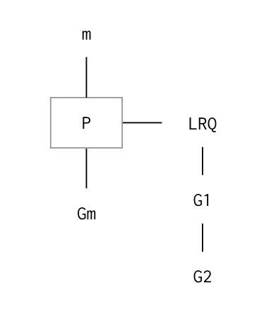
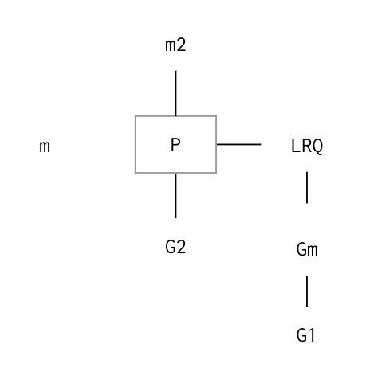

## Concurrency

### Mechanics

#### Goroutine

##### Go Scheduler Internals

Every time our Go's program starts up, it looks to see how many cores are available. Then it creates a logical processor.

The operating system scheduler is considered a preemptive scheduler. It runs down there in the kernel. Its job is to look at all the threads that are in runnable states and gives them the opportunity to run on some cores. These algorithms are fairly complex: waiting, bouncing threads, keeping memory of threads, caching,... The operating system is doing all of that for us. The algorithm is really smart when it comes to multicore processors. Go doesn't want to reinvent the wheel. It wants to sit on top of the operating system and leverage it.

The operating system is still responsible for operating system threads, scheduling operating system threads efficiently. If we have a 2 core machine and a thousands threads that the operating system has to schedule, that's a lot of work. A context switch on some operating system thread is expensive when the operating system has no clues of what that thread is doing.

It has to save all the possible states in order to be able to restore that to exactly the way it was. If there are fewer threads, each thread can get more time to be rescheduled. If there are more threads, each thread has less time over a long period of time.

"Less is more" is a really big concept here when we start to write concurrent software. We want to leverage the preemptive scheduler. So the Go's scheduler, the logical processor actually runs in user mode, the mode our application is running at. Because of that, we have to call the Go's scheduler a cooperating scheduler. What is brilliant here is the runtime that coordinates the operation. It still looks and feels as a preemptive scheduler up in user land. We will see how "less is more" concept gets to present itself and we get to do a lot more work with less. Our goal needs to be how much work we get done with the less number of threads.

Think about this in a simple way because processors are complex: hyperthreading, multiple threads per core, clock cycle. We can only execute one operating system thread at a time on any given core. If we only have 1 core, only 1 thread can be executed at a time. Anytime we have more threads in runnable states than we have cores, we are creating load, latency and we are getting more work done as we want. There needs to be this balance because not every thread is necessarily gonna be active at the same time. It all comes down to determining, understanding the workload for the software that we are writing.
Back to the first idea, when our Go program comes up, it has to see how many cores that are available. Let's say it found 1. It is going to create a logical processor P for that core.

Again, the operating system is scheduling things around operating system threads. What this processor P will get is an m, where m stands for machine. It represents an operating system thread that the operating system is going to schedule and allows our code to run.

The Linux scheduler has a run queue. Threads are placed in a run queue in certain cores or family of cores and those are constantly bound as threads are running. Go is gonna do the same thing. Go has its run queue as well. It has Global Run Queue (GRQ) and every P has a Local Run Queue (LRQ).

##### Goroutine

What is a Goroutine? It is a path of execution. Threads are paths of execution. That path of execution needs to be scheduled. In Go, every function or method can be created to be a Goroutine, and can become an independent path of execution that can be scheduled to run on some operating system threads against some cores.

When we start our Go program, the first thing runtime gonna do is create a Goroutine and put that in some main LRQ for some P. In our case, we only have 1 P here so we can imagine that Goroutine is attached to P.

A Goroutine, just like thread, can be in one of three major states: sleeping, executing or in a runnable state asking to wait for some time to execute on the hardware. When the runtime creates a Goroutine, it is placed in P and multiplex on this thread. Remember that it's the operating system that takes the thread, scheduling it, placing it on some core and doing execution. So Go's scheduler is gonna take all the code related to that Goroutines path of execution, place it on a thread, tell the operating system that this thread is in runnable state and can we execute it. If the answer is yes, the operating system starts to execute on some cores there in the hardware.

As the main Goroutine runs, it might want to create more paths of execution, more Goroutines.

When that happens, those Goroutines might find themselves initially in the GRQ. These would be Goroutines that are in runnable state but haven't been assigned to some Ps yet. Eventually, they would end up in the LRQ where they're saying they would like some time to execute.

This queue does not necessarily follow First-In-First-Out protocol. We have to understand that everything here is non-deterministic, just like the operating system scheduler. We cannot predict what the scheduler is gonna do when all things are equal. It is gonna make sure there is a balance. Until we get into orchestration, till we learn how to coordinate these executions of these Goroutines, there is no predictability.

Here is the mental model of our example.



We have Gm executing on for this thread for this P, and we are creating 2 more Goroutines G1 and G2. Because this is a cooperating scheduler, that means that these Goroutines have to cooperate to be scheduled and to have a context switch on this operating system thread m.

There are 4 major places in our code where the scheduler has the opportunity to make a scheduling decision.

- The keyword go that we aregoing to create Goroutines.That is also an opportunity for the scheduler to rebalance when it has multiple P.
- A system call.These systemcalls tend to happen all the time already.
- A channel operation because there is mutex(blockingcall) that we will learn later.
- Garbage collection.

Back to the example, says the scheduler might decide Gm has enough time to run, it will put Gm back to the run queue and allow G1 to run on that m. We are now having a context switch.


Let's say G1 decides to open up a file. Opening up a file can take microseconds or 10 milliseconds. We don't really know. If we allow this Goroutine to block this operating system thread while we open up that file, we are not getting more work done. In this scenario here, having a single P, we have a single threaded software application. All Goroutines only execute on the m attached to this P. What happens is this Goroutine is gonna block this m for a long time. We are basically stalled while we still have work that needs to get done. So the scheduler is not gonna allow that to happen, What actually happens is that the scheduler is gonna detach that m and G1. It is gonna bring a new m, say m2, then decide what G from the run queue should run next, say G2.


We now have 2 threads in a single threaded program. From our perspective, we are still single threading because the code that we are writing, the code associated with any G can only run against this P and this m. However, we don't know at any given time what m we are running on. M can get swapped out but we are still single threaded.

Eventually, G1 will come back, the file will be opened. The scheduler is gonna take this G1 and put it back to the run queue so we can be executed again on this P for some m (m2 in this case). m is placed on the side for later use. We are still maintaining these 2 threads. The whole process can happen again.



It is a really brilliant system of trying to leverage this thread to its fullest capability by doing more on 1 thread. Let's do so much on this thread we don't need another.

There is something called a Network poller. It is gonna do all the low level networking asynchronous networking stuff. Our G, if it is gonna do anything like that, it might be moved out to the Network poller and then brought back in. From our perspective, here is what we have to remember: The code that we are writing always runs on some P against some m. Depending on how many P we have, that's how many threads variables for us to run.

Concurrency is about managing a lot of things at once. This is what the scheduler is doing. It manages the execution of these 3 Goroutines against this one m for this P. Only 1 Goroutine can be executed at a single time.
If we want to do something in parallel, which means doing a lot of things at once, then we would need to create another P that has another m, say m3.


Both are scheduled by the operating system. So now we can have 2 Goroutines running at the same time in parallel.

Let's try another example.

We have multiple threaded software. The program launched 2 threads. Even if both threads end up on the same core, each wants to pass a message to each other. What has to happen from the operating system point of view?

We have to wait for thread 1 to get scheduled and placed on some cores - a context switch (CTX) has to happen here. While that's happening, thread is asleep so it's not running at all. From thread 1, we send a message over and want to wait to get a message back. In order to do that, there is another context switch needs to happen because we can put a different thread on that core. We are waiting for the operating system to schedule thread 2 so we are going to get another context switch, waking up and running, processing the message and sending the message back. On every single message that we are passing back and forth, thread is going from executable state to runnable state to asleep state. This is gonna cost a lot of context switches to occur.

Let's see what happens when we are using Goroutines, even on a single core.
G1 wants to send a message to G2 and we perform a context switch. However, the context here is the user's space switch. G1 can be taken out of the thread and G2 can be put on the thread. From the operating system point of view, this thread never goes to sleep. This thread is always executing and never needed to be context switched out. It is the Go's scheduler that keeps the Goroutines context switched.

If a P for some m here has no work to do, there is no G, the runtime scheduler will try to spin that m for a little bit to keep it hot on the core. Because if that thread goes cold, the operating system will pull it off the core and put something else on. So it just spins a little bit to see if there will be another G coming in to get some work done.

This is how the scheduler works underneath. We have a P, attached to thread m. The operating system will do the scheduling. We don't want any more than cores we have. We don't need any more operating system threads than cores we have. If we have more threads than cores we have, all we do is put load on the operating system. We allow the Go's scheduler to make decisions on our Goroutines, keeping the least number of threads we need and hot all the time if we have work. The Go's scheduler is gonna look and feel preemptive even though we are calling a cooperating scheduler.

However, let's not think about how the scheduler works. Think the following way makes it easier for future development. Every single G, every Goroutine that is in runnable state, is running at the same time.

#### Language Mechanics

One of the most important things that we must do from day one is to write software that can startup and shutdown cleanly. This is very very important.

```go
package​ main

import​ (
    "fmt"
    "runtime"
    "sync"
)
```

init calls a function from the runtime package called GOMAXPROCS. This is also an environment variable, which is why it is all capitalized.

Prior to 1.5, when our Go program came up for the first time, it came up with just a single P, regardless of how many cores. The improvement that we made to the garbage collector and scheduler changed all that.

Allocate one logical processor for the scheduler to use.

```go
func​ ​init​() {
    runtime.GOMAXPROCS(​1​)
}

func​ ​main​() {
```

wg is used to manage concurrency. wg is set to its zero value. This is one of the very special types in Go that are usable in its zero value state. It is also called Asynchronous Counting Semaphore. It has three methods: Add, Done and Wait. n number of Goroutines can call this method at the same time and it's all serialized.

- Add keeps a count of how many Goroutines out there.
- Done decrements that count because some Goroutines are about to be terminated.
- Wait holds the program until that count goes back down to zero.

```go
    var​ wg sync.WaitGroup
```

We are creating 2 Goroutines. We rather call Add(1) and call it over and over again to increment by 1. If we don't know how many Goroutines that we are going to create, that is a smell.

```go
    wg.Add(​2​)

    fmt.Println(​"Start Goroutines"​)
```

Create a Goroutine from the uppercase function using anonymous function. We have a function decoration here with no name and being called by the () in the end. We are declaring and calling this function right here, inside of main. The big thing here is the keyword go in front of func().
We don't execute this function right now in series here. Go schedules that function to be a G, say G1, and load in some LRQ for our P. This is our first G. Remember, we want to think that every G that is in runnable state is running at the same time. Even though we have a single P, even though we have a single thread, we don't care. We are having 2 Goroutines running at the same time: main and G1.

```go
    go​ ​func​() {
        lowercase()
        wg.Done()
    }()
```

Wait for the Goroutines to finish. This is holding main from terminating because when the main terminates, our program terminates, regardless of what any other Goroutine is doing.

There is a golden rule here: We are not allowed to create a Goroutine unless we can tell when and how it terminates. Wait allows us to hold the program until the two other Goroutines report that they are done. It is gonna wait, count from 2 to 0. When it reaches 0, the scheduler will wake up the main Goroutine again and allow it to be terminated.

```go
    fmt.Println(​"Waiting To Finish"​) wg.Wait()
    wg.Wait()

    fmt.Println(​"\nTerminating Program"​)
}
```

lowercase displays the set of lowercase letters three times. Display the alphabet three times.

```go
func​ ​lowercase​() {
    for​ count := ​0​; count < ​3​; count++ {
        for​ r := ​'a'​; r <= ​'z'​; r++ {
            fmt.Printf(​"%c "​, r)
        }
    }
}
```

uppercase displays the set of uppercase letters three times. Display the alphabet three times.

```go
func​ ​uppercase​() {
    for​ count := ​0​; count < ​3​; count++ {
        for​ r := ​'A'​; r <= ​'Z'​; r++ {
            fmt.Printf(​"%c "​, r)
        }
    }
}
```

```
Start Goroutines
Waiting To Finish
A B C D E F G H I J K L M N O P Q R S T U V W X Y Z A B C D E F G H I J
K L M N O P Q R S T U V W X Y Z A B C D E F G H I J K L M N O P Q R S T
U V W X Y Z a b c d e f g h i j k l m n o p q r s t u v w x y z a b c d
e f g h i j k l m n o p q r s t u v w x y z a b c d e f g h i j k l m n
o p q r s t u v w x y z
Terminating Program
```

##### Sequence

We call the uppercase after lowercase but Go's scheduler chooses to call the lowercase first. Remember we are running on a single thread so there is only one Goroutine is executed at a given time here. We can't see that we are running concurrently that the uppercase runs before the lowercase. Everything starts and completes cleanly.

What if we forget to hold Wait?

We would see no output of uppercase and lowercase. This is pretty much a data race. It's a race to see the program terminate before the scheduler stops it and schedules another Goroutine to run. By not waiting, these Goroutines never get a chance to execute at all.

What if we forget to call Done?

Deadlock!

This is a very special thing in Go. When the runtime determines that all the Goroutines are there and can no longer move forward, it's gonna panic.

##### Goroutine time slicing

How the Go's scheduler, even though it is a cooperating scheduler (not preemptive), it looks and feels preemptive because the runtime scheduler is making all the decisions for us. It is not coming for us.

The program below will show us a context switch and how we can predict when the context switch is going to happen. It is using the same pattern that we've seen in the last file. The only difference is the printPrime function.

```go
package​ main

import​ (
    "fmt"
    "runtime"
    "sync"
)
```

Allocate one logical processor for the scheduler to use.

```go
func init() {
    runtime.GOMAXPROCX(1)
}
```

wg is used to manage concurrency.

```go
func​ ​main​() {
    var​ wg sync.WaitGroup
    wg.Add(​2​)

    fmt.Println(​"Create Goroutines"​)
```

Create the first goroutine and manage its lifecycle here.

```go
    go​ ​func​() {
        printPrime(​"A"​)
        wg.Done()
    }()
```

Create the second goroutine and manage its lifecycle here.

```go
    go​ ​func​() {
        printPrime(​"B"​)
        wg.Done()
    }()
```

Wait for the goroutines to finish.

```go
    fmt.Println(​"Waiting To Finish"​)
    wg.Wait()

    fmt.Println(​"Terminating Program"​)
}
```

printPrime displays prime numbers for the first 5000 numbers. printPrime is not special. It just requires a little bit more time to complete. When we run the program, what we will see are context switches at some point for some particular prime number. We cannot predict when the context switch will happen. That's why we say the Go's scheduler looks and feels very preemptive even though it is a cooperating scheduler.

```go
func​ ​printPrime​(prefix ​string​) {
next:
    for​ outer := ​2​; outer < ​5000​; outer++ {
        for​ inner := ​2​; inner < outer; inner++ {
            if​ outer%inner == ​0​ {
                continue​ next
            }
        }

        fmt.Printf(​"%s:%d\n"​, prefix, outer)
    }

    fmt.Println(​"Completed"​, prefix)
}
```

```
Create Goroutines
Waiting To Finish
B:2
B:3
B:5
B:7
B:11
B:13
B:17
B:19
...
B:4999
Completed B A:2
A:3
A:5
A:7
A:11
A:13
A:17
A:19
...
A:4999
Completed A
Terminating Program
```

##### Goroutines and parallelism

This programs show how Goroutines run in parallel. We are going to have 2 P with 2 m, and 2 Goroutines running in parallel on each m. This is still the same program that we are starting with. The only difference is that we are getting rid of the lowercase and uppercase function and putting their code directly inside Go's anonymous functions.

```go
package​ main
import​ (
    "fmt"
    "runtime"
    "sync"
)

func​ ​init​() {
```

Allocate 2 logical processors for the scheduler to use.

```go
    runtime.GOMAXPROCS(​2​)
}

func​ ​main​() {
```

wg is used to wait for the program to finish. Add a count of two, one for each goroutine.

```go
    var​ wg sync.WaitGroup
    wg.Add(​2​)

    fmt.Println(​"Start Goroutines"​)
```

Declare an anonymous function and create a goroutine. Display the alphabet three times.

```go
    go​ ​func​() {
        for​ count := ​0​; count < ​3​; count++ {
            for​ r := ​'a'​; r <= ​'z'​; r++ {
                fmt.Printf(​"%c "​, r)
            }
        }
```

Tell main we are done.

```go
        wg.Done()
    }()
```

Wait for the goroutines to finish.

```go
    fmt.Println(​"Waiting To Finish"​)
    wg.Wait()

    fmt.Println(​"\nTerminating Program"​)
}
```

Looking at the output, we can see a mix of uppercase or lowercase characters.

```
Start Goroutines
Waiting To Finish
a b c d e f g h i j k l m n o p q r s t u v w x y z a b c d e f g h i j
k l m n o p A B C D E F G H I J K L M N O P Q R S q r s t u v w x y z a
b c d e f g h i j k l m n o p q r s t u v w x y z T U V W X Y Z A B C D
E F G H I J K L M N O P Q R S T U V W X Y Z A B C D E F G H I J K L M N
O P Q R S T U V W X Y Z
Terminating Program
```
