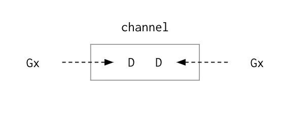

#### Channel 139

##### Language Mechanics 139

Channels are for orchestration. They allow us to have 2 Goroutines participate in some sort of workflow and give us the ability to orchestrate in a predictable way. The one thing that we really need to think about is not that a channel is a queue, even though it seems to be implemented like a queue, first in first out. We will have a difficult time if we think that way. What we want to think about instead is a channel as a way of signaling events to another Goroutine. What is nice here is that we can signal an event with data or without data.

If everything we do has signaling in mind, we are going to use channel in a proper way. Go has 2 types of channels: unbuffered and buffered. They both allow us to signal with data. The big difference is that, when we use an unbuffered channel, we are signaling and getting a guarantee the signal was received. We are not gonna be sure if that Goroutine is done whatever work we assign it to do but we do have the guarantee. The trade off for the guarantee that the signal was received is higher latency because we have to wait to make sure that the Goroutine on the other side of that unbuffered channel receives the data.

This is how the unbuffered channel is going to work. There is gonna be a Goroutine coming to the channel. The channel wants to signal with some piece of data. It is gonna put the data right there in the channel. However, the data is locked in and cannot move because the channel has to know if there is another Goroutine on the other side to receive it. Eventually a Goroutine comes and says that it wants to receive the data. Both of Goroutines are not putting their hands in the channel. The data now can be transferred.

Here is the key to why that unbuffered channel gives us that guarantee: the receive happens first. When the receive happens, we know that the data transfer has occurred and we can walk away.



The unbuffered channel is a very powerful channel. We want to leverage that guarantee as much as possible. But again, the cost of the guarantee is higher latency because we have to wait for this.

The buffered channel is a bit different: we do not get the guarantee but we get to reduce the amount of latencies on any given send or receive.

Back to the previous example, we replace the unbuffered channel with a buffered channel. We are gonna have a buffered channel of just 1. It means there is a space in this channel for 1 piece of data that we are using the signal and we don't have to wait for the other side to get it. So now a Goroutine comes in, puts the data in and then moves away immediately. In other words, the send is happening before the receive. All the sending Goroutine knows is that it issues the signal, puts that data but has no clue when the signal is going to be received. Now hopefully a Goroutine comes in. It sees that there is data there, receive it and move on.


We use a buffered channel of 1 when dealing with these types of latency. We may need buffers that are larger but there are some design rules that we are gonna learn later on we use buffers that are greater than 1. But if we are in a situation where we can have these sends coming in and they could potentially be locked then we have to think again: if the channel of 1 is fast enough to reduce the latency that we are dealing with. Because what's gonna happen is the following: What we are hoping is, the buffered channel is always empty every time we perform a send.

Buffered channels are not for performance. What the buffered channel needs to be used for is continuity, to keep the wheel moving. One thing we have to understand is that everybody can write a piece of software that works when everything is going well. When things are going bad, it's where the architecture and engineer really come in. Our software doesn't enclose and it doesn't cost stress. We need to be responsible.

Back to the example, it's not important that we know exactly the signaling data was received but we do have to make sure that it was. The buffered channel of 1 gives us almost guarantee because what happens is: it performs a send, puts the data in there, turns around and when it comes back, it sees that the buffered is empty. Now we know that it was received. We don't know immediately at the time that we sent but by using a buffer of 1, we do know that it is empty when we come back.

Then it is okay to put another piece of data in there and hopefully when we come back again, it is gone. If it's not gone, we have a problem. There is a problem upstream. We cannot move forward until the channel is empty. This is something that we want to report immediately because we want to know why the data is still there. That's how we can build systems that are reliable.

We don't take more work at any given time. We identify upstream when there is a problem so we don't put more stress on our systems. We don't take more responsibilities for things that we shouldn't be.

##### Unbuffered channel: Signaling with data 141

```go
package main

import (

"fmt"

"time"

)

func main() {

fmt.Printf("\n=> Basics of a send and receive\n")

basicSendRecv()

fmt.Printf("\n=> Close a channel to signal an event\n")

signalClose()

}
```

basicSendRecv shows the basics of a send and receive. We are using make function to create a channel. We have no other way of creating a channel that is usable until we use make. Channel is also based on type, a type of data that we are gonna do the signaling. In this case, we use string. That channel is a reference type. ch is just a pointer variable to larger data structure underneath.

```go
func basicSendRecv() {
```

This is an unbuffered channel.

```go
    ch := make(chan string)

    go func() {
```

This is a send: a binary operation with the arrow pointing into the channel. We are signaling with a string "hello".

```go
    ch <- "hello"
    }()
```

This is a receive: also an arrow but it is a unary operation where it is attached to the left hand side of the channel to show that it is coming out. We now have an unbuffered channel where the send and receive have to come together. We also know that the signal has been received because the receive happens first. Both are gonna block until both come together so the exchange can happen.

```go
    fmt.Println(<-ch)
}
```

signalClose shows how to close a channel to signal an event.

```go
func signalClose() {
```

We are making a channel using an empty struct. This is a signal without data.

```go
    ch := make(chan struct{})
```

We are gonna launch a Goroutine to do some work. Suppose that it's gonna take 100 millisecond. Then, it wants to signal another Goroutine that it's done. It's gonna close the channel to report that it's done without the need of data. When we create a channel, buffered or unbuffered, that channel can be in 2 different states. All channels start out in open state so we can send and receive data. When we change the state to be closed, it cannot be opened. We also cannot close the channel twice because that is an integrity issue. We cannot signal twice without data twice.

```go
go func() {

time.Sleep(100 * time.Millisecond)

fmt.Println("signal event")

close(ch)

}()
```

When the channel is closed, the receive will immediately return. When we receive on a channel that is open, we cannot return until we receive the data signal. But if we receive on a channel that is closed, we are able to receive the signal without data. We know that event has occurred. Every receive on that channel will immediately return.

```go
    <-ch

    fmt.Println("event received")

}
```

```go
=> Basics of a send and receive
hello

=> Close a channel to signal an event
signal event
event received
```

##### Unbuffered channel: Double signal 143

```go
package main

import (
    "fmt"
    "math/rand"
    "time"
)

func main() {
    fmt.Printf("\n=> Double signal\n")
    signalAck()

    fmt.Printf("\n=> Select and receive\n")
    selectRecv()

    fmt.Printf("\n=> Select and send\n")
    selectSend()

    fmt.Printf("\n=> Select and drop\n")
    selectDrop()
}
```

signalAck shows how to signal an event and wait for an acknowledgement it is done, It does not only want to guarantee that a signal is received but also want to know when that work is done. This is gonna like a double signal.

```go
func signalAck() {
    ch := make(chan string)

    go func() {
        fmt.Println(<-ch)
        ch <- "ok done"
}()
```

It blocks on the receive. This Goroutine can no longer move on until we receive a signal.

```go
    ch <- "do this"
    fmt.Println(<-ch)
}
```

```
=> Double signal
do this
ok done
```

##### Unbuffered channel: select and receive 144

Select allows a Goroutine to work with multiple channels at a time, including send and receive. This can be great when creating an event loop but not good for serializing shared state. selectRecv shows how to use the select statement to wait for a specific amount of time to receive a value.

```go
func selectRecv() {
    ch := make(chan string)
```

Wait for some amount of time and perform a send.

```go
    go func() {
        time.Sleep(time.Duration(rand.Intn(200)) * time.Millisecond)
        ch <- "work"
    }()
```

Perform 2 different receives on 2 different channels: one above and one for time. time.After returns a channel that will send the current time after that duration. We want to receive the signal from the work sent but we are not willing to wait forever. We only wait 100 milliseconds then we will move on.

```go
    select {
    case v := <-ch:
        fmt.Println(v)
    case <-time.After(100 * time.Millisecond):
        fmt.Println("timed out")
}
```

However, there is a very common bug in this code. One of the biggest bugs we are going to have and potential memory is when we write code like this and we don't give the Goroutine an opportunity to terminate. We are using an unbuffered channel and this Goroutine at some point, its duration will finish and it will want to perform a send. But this is an unbuffered channel. This send cannot be completed unless there is a corresponding receive. What if this Goroutine times out and moves on? There is no more corresponding receive. Therefore, we will have a Goroutine leak, which means it will never be terminated.

The cleanest way to fix this bug is to use the buffered channel of 1. If this send happens, we don't necessarily have the guarantee. We don't need it. We just need to perform the signal then we can walk away. Therefore, either we get the signal on the other side or we walk away. Even if we walk away, this send can still be completed because there is room in the buffer for that send to happen.

```go
=> Select and receive
work
```

##### Unbuffered channel: select and send 145

selectSend shows how to use the select statement to attempt a send on a channel for a specific amount of time.

```go
func selectSend() {
    ch := make(chan string)

    go func() {
        time.Sleep(time.Duration(rand.Intn(200)) * time.Millisecond)
        fmt.Println(<-ch)
    }()

    select {
    case ch <- "work":
        fmt.Println("send work")
    case <-time.After(100 * time.Millisecond):
        fmt.Println("timed out")
}
```

Similar to the above function, Goroutine leak will occur. Once again, a buffered channel of 1 will save us here.

```go
=> Select and send
work
send work
```

##### Buffered channel: Select and drop 146

selectDrop shows how to use the select to walk away from a channel operation if it will immediately block.

This is a really important pattern. Imagine a situation where our service is flushed with work to do or work is gonna come. Something upstream is not functioning properly. We can't just back up the work. We have to throw it away so we can keep moving on.

A Denial-of-service attack is a great example. We get a bunch of requests coming to our server. If we try to handle every single request, we are gonna implode. We have to handle what we can and drop other requests.

Using this type of pattern (fanout), we are willing to drop some data. We can use buffer that are larger than 1. We have to measure what the buffer should be. It cannot be random.

```go
func selectDrop() {
    ch := make(chan int, 5)

    go func() {
```

We are in the receive loop waiting for data to work on.

```go
        for v := range ch {
            fmt.Println("recv", v)
        }
    }()
```

This will send the work to the channel. If the buffer fills up, which means it blocks, the default case comes in and drops things.

```go
    for i := 0; i < 20; i++ {
        select {
        case ch <- i:
            fmt.Println("send work", i)
        default:
            fmt.Println("drop", i)
        }
    }

    close(ch)
}
```

```
=> Select and drop
send work 0
send work 1
send work 2
send work 3
send work 4
send work 5
drop 6
drop 7
drop 8
drop 9
drop 10
drop 11
drop 12
drop 13
drop 14
drop 15
recv 0
recv 1
recv 2
recv 3
recv 4
recv 5
drop 16
send work 17
send work 18
send work 19
```

##### Unbuffered channel (Tennis match) 148

This program will put 2 Goroutines in a tennis match. We use an unbuffered channel because we need to guarantee that the ball is hit on both sides or missed.

```go
package main

import (
    "fmt"
    "math/rand"
    "sync"
    "time"
)

func init() {
    rand.Seed(time.Now().UnixNano())
}

func main() {
```

Create an unbuffered channel.

```go
    court := make(chan int)
```

wg is used to manage concurrency.

```go
    var wg sync.WaitGroup
    wg.Add(2)
```

Launch two players. Both are gonna start out in a receive mode. We are not really sure who is gonna get the ball first. Imagine the main Goroutine is the judge. It depends on the judge to choose.

```go
    go func() {
        player("Hoanh", court)
        wg.Done()
    }()

    go func() {
        player("Andrew", court)
        wg.Done()
    }()
```

Start the set. The main Goroutine here is performing a send. Since both players are in receive mode, we cannot predict which one will go first.

```go
    court <- 1
```

Wait for the game to finish.

```go
    wg.Wait()
}
```

player simulates a person playing the game of tennis. We are asking for a channel value using value semantic.

```go
func player(name string, court chan int) {
    for {
```

Wait for the ball to be hit back to us. Notice that this is another form of receive. Instead of getting just the value, we can get a flag indicating how the receive is returned. If the signal happens because of the data, ok will be true. If the signal happens without data, in other words, the channel is closed, ok will be false. In this case, we are gonna use that to determine who won.

```go
        ball, ok := <-court
        if !ok {
```

If the channel was closed we won.

```go
        fmt.Printf("Player %s Won\n", name)
        return
    }
```

Pick a random number and see if we miss the ball (or we lose). If we lose the game, we are gonna close the channel. It then causes the other player to know that he is receiving the signal but without data. The channel is closed so he won. They both return.

```go
        n := rand.Intn(100)
        if n%13 == 0 {
            fmt.Printf("Player %s Missed\n", name)
```

Close the channel to signal we lost.

```go
            close(court)
            return
        }
```

Display and then increment the hit count by one.If the 2 cases above doesn't happen, we still have the ball. Increase the value of the ball by one and perform a send. We know that the other player is still in receive mode, therefore, the send and receive will eventually come together. Again, in an unbuffered channel, the receive happens first because it gives us the guarantee.

```go
        fmt.Printf("Player %s Hit %d\n", name, ball)
        ball++
```

Hit the ball back to the opposing player.

```go
        court <- ball
    }
}
```

```
Player Andrew Missed
Player Hoanh Won
```

##### Unbuffered channel (Replay race) 150

The program shows how to use an unbuffered channel to simulate a relay race between four Goroutines. Imagine we have 4 runners that are on the track. Only 1 can run at a time. We have the second runner on the track until the last one. The second one waits to be exchanged.

```
package main

import (
    "fmt"
    "sync"
    "time"
)
```

wg is used to wait for the program to finish.
var wg sync.WaitGroup

```go
func main() {
```

Create an unbuffered channel.

```go
    track := make(chan int)
```

Add a count of one for the last runner. We only add one because all we care about is the last runner in the race telling us that he is done.

```go
    wg.Add(1)
```

Create a first runner to his mark.

```go
    go Runner(track)
```

The main Goroutine starts the race (shoots the gun). At this moment, we know that on the other side, a Goroutine is performing a receive.

```go
    track <- 1
```

Wait for the race to finish.

```go
    wg.Wait()
}
```

Runner simulates a person running in the relay race. This Runner doesn't have a loop because it's gonna do everything from the beginning to end and then terminate. We are gonna keep adding Goroutines (Runners) in order to make this pattern work.

```go
func Runner(track chan int) {
```

The number of exchanges of the baton.

```go
    const maxExchanges = 4

    var exchange int
```

Wait to receive the baton with data.

```go
    baton := <-track
```

Start running around the track.

```go
    fmt.Printf("Runner %d Running With Baton\n", baton)
```

New runner to the line. Are we the last runner on the race? If not, we increment the data by 1 to keep track which runner we are on. We will create another Goroutine. It will go immediately into a receive. We are now having a second Groutine on the track, in the receive waiting for the baton. (1)

```go
    if baton < maxExchanges {
        exchange = baton + 1
        fmt.Printf("Runner %d To The Line\n", exchange)
        go Runner(track)
    }
```

Running around the track.

```go
    time.Sleep(100 * time.Millisecond)
```

Is the race over.

```go
    if baton == maxExchanges {
        fmt.Printf("Runner %d Finished, Race Over\n", baton)
        wg.Done()
        return
    }
```

Exchange the baton for the next runner.

```go
    fmt.Printf("Runner %d Exchange With Runner %d\n", baton, exchange)
```

Since we are not the last runner, perform a send so (1) can receive it.

```go
    track <- exchange
}
```

```go
Runner 1 Running With Baton
Runner 2 To The Line
Runner 1 Exchange With Runner 2
Runner 2 Running With Baton
Runner 3 To The Line
Runner 2 Exchange With Runner 3
Runner 3 Running With Baton
Runner 4 To The Line
Runner 3 Exchange With Runner 4
Runner 4 Running With Baton
Runner 4 Finished, Race Over
```

##### Buffered channel: Fan Out 153

This is a classic use of a buffered channel that is greater than 1. It is called a Fan Out Pattern.

Idea: A Goroutine is doing its thing and decides to run a bunch of database operations. It is gonna create a bunch of Goroutines, say 10, to do that. Each Goroutine will perform 2 database operations. We end up having 20 database operations across 10 Goroutines. In other words, the original Goroutine will fan 10 Goroutines out, wait for them all to report back.

The buffered channel is fantastic here because we know ahead of time that there are 10 Goroutines performing 20 operations, so the size of the buffer is 20. There is no reason for any of these operation signals to block because we know that we have to receive this at the end of the day.

```go
package main

import (
    "fmt"
    "log"
    "math/rand"
    "time"
)
```

result is what is sent back from each operation.

```go
type result struct {
    id  int
    op  string
    err error
}

func init() {
    rand.Seed(time.Now().UnixNano())
}

func main() {
```

Set the number of Goroutines and insert operations.

```go
    const routines = 10
    const inserts = routines * 2
```

Buffered channel to receive information about any possible insert.

```go
    ch := make(chan result, inserts)
```

Number of responses we need to handle. Instead of using a WaitGroup, since this Goroutine can maintain its stack space, we are gonna use a local variable as our WaitGroup. We will decrement that as we go. Therefore, we set it to 20 inserts right out the box.

```go
    waitInserts := inserts
```

Perform all the inserts. This is the fan out. We are gonna have 10 Goroutines. Each Goroutine performs 2 inserts. The result of the insert is used in a ch channel. Because this is a buffered channel, none of these send blocks.

```go
    for i := 0; i < routines; i++ {
        go func(id int) {
            ch <- insertUser(id)
```

We don't need to wait to start the second insert thanks to the buffered channel. The first send will happen immediately.

```go
            ch <- insertTrans(id)
        }(i)
    }
```

Process the insert results as they complete.

```go
    for waitInserts > 0 {
```

Wait for a response from a Goroutine. This is a receive. We are receiving one result at a time and decrement the waitInserts until it gets down to 0.

```go
        r := <-ch
```

Display the result.

```go
        log.Printf("N: %d ID: %d OP: %s ERR: %v", waitInserts, r.id, r.op, r.err)
```

Decrement the wait count and determine if we are done.

```go
        waitInserts--
    }
    log.Println("Inserts Complete")
}
```

insertUser simulates a database operation.

```go
func insertUser(id int) result {
    r := result{
        id: id,
        op: fmt.Sprintf("insert USERS value (%d)", id),
}
```

Randomize if the insert fails or not.

```go
    if rand.Intn(10) == 0 {
        r.err = fmt.Errorf("Unable to insert %d into USER table", id)
    }
    return r
}
```

insertTrans simulates a database operation.

```go
func insertTrans(id int) result {
    r := result{
        id: id,
        op: fmt.Sprintf("insert TRANS value (%d)", id),
    }
```

Randomize if the insert fails or not.

```
    if rand.Intn(10) == 0 {
        r.err = fmt.Errorf("Unable to insert %d into USER table", id)
    }
    return r
}
```

```
2020/08/24 18:18:19 N: 20 ID: 0 OP: insert USERS value (0) ERR: <nil>
2020/08/24 18:18:19 N: 19 ID: 0 OP: insert TRANS value (0) ERR: <nil>
2020/08/24 18:18:19 N: 18 ID: 1 OP: insert USERS value (1) ERR: <nil>
2020/08/24 18:18:19 N: 17 ID: 1 OP: insert TRANS value (1) ERR: <nil>
2020/08/24 18:18:19 N: 16 ID: 2 OP: insert USERS value (2) ERR: <nil>
2020/08/24 18:18:19 N: 15 ID: 2 OP: insert TRANS value (2) ERR: Unable to insert 2 into USER table
2020/08/24 18:18:19 N: 14 ID: 3 OP: insert USERS value (3) ERR: Unable to insert 3 into USER table
2020/08/24 18:18:19 N: 13 ID: 3 OP: insert TRANS value (3) ERR: <nil>
2020/08/24 18:18:19 N: 12 ID: 4 OP: insert USERS value (4) ERR: <nil>
2020/08/24 18:18:19 N: 11 ID: 4 OP: insert TRANS value (4) ERR: <nil>
2020/08/24 18:18:19 N: 10 ID: 5 OP: insert USERS value (5) ERR: <nil>
2020/08/24 18:18:19 N: 9 ID: 5 OP: insert TRANS value (5) ERR: <nil>
2020/08/24 18:18:19 N: 8 ID: 6 OP: insert USERS value (6) ERR: <nil>
2020/08/24 18:18:19 N: 7 ID: 6 OP: insert TRANS value (6) ERR: <nil>
2020/08/24 18:18:19 N: 6 ID: 7 OP: insert USERS value (7) ERR: <nil>
2020/08/24 18:18:19 N: 5 ID: 7 OP: insert TRANS value (7) ERR: Unable to insert 7 into USER table
2020/08/24 18:18:19 N: 4 ID: 8 OP: insert USERS value (8) ERR: <nil>
2020/08/24 18:18:19 N: 3 ID: 8 OP: insert TRANS value (8) ERR: <nil>
2020/08/24 18:18:19 N: 2 ID: 9 OP: insert USERS value (9) ERR: <nil>
2020/08/24 18:18:19 N: 1 ID: 9 OP: insert TRANS value (9) ERR: <nil>
2020/08/24 18:18:19 Inserts Complete
```

##### Select 157

This sample program demonstrates how to use a channel to monitor the amount of time the program is running and terminate the program if it runs too long.

```go
package main

import (
    "errors"
    "log"
    "os"
    "os/signal"
    "time"
)
```

Give the program 3 seconds to complete the work.

```go
const timeoutSeconds = 3 * time.Second
```

There are 4 channels that we are gonna use: 3 unbuffered and 1 buffered of 1.

```go
var (
```

sigChan receives operating signals. This will allow us to send a Ctrl-C to shut down our program cleanly.

```go
    sigChan = make(chan os.Signal, 1)
```

timeout limits the amount of time the program has. We really don't want to receive on this channel because if we do, that means something bad happens, we are timing out and we need to kill the program.

```go
    timeout = time.After(timeoutSeconds)
```

complete is used to report processing is done. This is the channel we want to receive on. When the Goroutine finishes the job, it will signal to us on this complete channel and tell us any error that occurred.

```go
    complete = make(chan error)
```

shutdown provides system wide notification.

```go
    shutdown = make(chan struct{})
)

func main() {
    log.Println("Starting Process")
```

We want to receive all interrupt based signals. We are using a Notify function from the signal package, passing sigChan telling the channel to look for anything that is os.Interrupt related and sending us a data signal on this channel. One important thing about this API is that it won't wait for us to be ready to receive the signal. If we are not there, it will drop it on the floor. That's why we are using a buffered channel of 1. This way we guarantee to get at least 1 signal. When we are ready to act on that signal, we can come over there and do it.

```go
    signal.Notify(sigChan, os.Interrupt)
```

Launch the process.

```go
    log.Println("Launching Processors")
```

This Goroutine will do the processing job, for example image processing.

```go
    go processor(complete)
```

The main Goroutine here is in this event loop and it's gonna loop forever until the program is terminated. There are 3 cases in select, meaning that there are 3 channels we are trying to receive on at the same time: sigChan, timeout, and complete.

```go
ControlLoop:
    for {
        select {
        case <-sigChan:
```

Interrupt event signaled by the operating system.

```go
            log.Println("OS INTERRUPT")
```

Close the channel to signal to the processor it needs to shutdown.

```go
            close(shutdown)
```

Set the channel to nil so we no longer process any more of these events.

If we try to send on a closed channel, we are gonna panic. If we receive on a closed channel, that's gonna immediately return a signal without data. If we receive on a nil channel, we are blocked forever. Similar with send. Why do we want to do that?

We don't want users to hold down Ctrl C or hit Ctrl C multiple times. If they do that and we process the signal, we have to call close multiple times. When we call close on a channel that is already closed, the code will panic. Therefore, we cannot have that.

```go
            sigChan = nil
        case <-timeout:
```

We have taken too much time. Kill the app hard.

```go
            log.Println("Timeout - Killing Program")
            os.Exit will terminate the program immediately.
            os.Exit(1)
        case err := <-complete:
```

Everything completed within the time given.

```go
            log.Printf("Task Completed: Error[%s]", err)
```

We are using a label break here. We put one at the top of the for loop so the case has a break and the for has a break.

```go
            break ControlLoop
        }
    }

    log.Println("Process Ended")
}
```

processor provides the main program logic for the program. There is something interesting in the parameter. We put the arrow on the right hand side of the chan keyword. It means this channel is a send-only channel. If we try to receive on this channel, the compiler will give us an error.

```go
func processor(complete chan<- error) {
    log.Println("Processor - Starting")
```

Variable to store any error that occurs. Passed into the defer function via closures.

```go
    var err error
```

Defer the send on the channel so it happens regardless of how this function terminates. This is an anonymous function call like we saw with Goroutine. However, we are using the keyword defer here.

We want to execute this function but after the processor function returns. This gives us a guarantee that we can have certain things happen before control go back to the caller.

Also, defer is the only way to stop a panic. If something bad happens, say the image library is blowing up, that can cause a panic situation throughout the code. In this case, we want to recover from that panic, stop it and then control the shutdown.

```go
    defer func() {
```

Capture any potential panic.

```go
        if r := recover(); r != nil {
            log.Println("Processor - Panic", r)
        }
```

Signal the Goroutine we have shut down.

```go
        complete <- err
    }()
```

Perform the work.

```go
    err = doWork()
    log.Println("Processor - Completed")
}
```

doWork simulates task work. Between every single call, we call checkShutdown. After completing every task, we are asked: Have we been asked to shutdown? The only way we know is that the shutdown channel is closed. The only way to know if the shutdown channel is closed is to try to receive. If we try to receive on a channel that is not closed, it's gonna block. However, the default case is gonna save us here.

```go
func doWork() error {
    log.Println("Processor - Task 1")
    time.Sleep(2 * time.Second)

    if checkShutdown() {
        return errors.New("Early Shutdown")
    }

    log.Println("Processor - Task 2")
    time.Sleep(1 * time.Second)

    if checkShutdown() {
        return errors.New("Early Shutdown")
    }

    log.Println("Processor - Task 3")
    time.Sleep(1 * time.Second)

    return nil
}
```

checkShutdown checks the shutdown flag to determine if we have been asked to interrupt processing.

```go
func checkShutdown() bool {
    select {
    case <-shutdown:
```

We have been asked to shut down cleanly.

```go
        log.Println("checkShutdown - Shutdown Early")
        return true

    default:
```

If the shutdown channel was not closed, presume with normal processing.

```go
        return false
    }
}
```

When we let the program run, since we configure the timeout to be 3 seconds, it will then timeout and be terminated.

```
2020/08/24 18:31:27 Starting Process
2020/08/24 18:31:27 Launching Processors
2020/08/24 18:31:27 Processor - Starting
2020/08/24 18:31:27 Processor - Task 1
2020/08/24 18:31:29 Processor - Task 2
2020/08/24 18:31:30 Timeout - Killing Program
exit status 1
```

When we hit Ctrl C while the program is running, we will see the OS INTERRUPT and the program is being shutdown early.

```
2020/08/24 18:21:02 Starting Process
2020/08/24 18:21:02 Launching Processors
2020/08/24 18:21:02 Processor - Starting
2020/08/24 18:21:02 Processor - Task 1
^C2020/08/24 18:21:03 OS INTERRUPT
2020/08/24 18:21:04 checkShutdown - Shutdown Early
2020/08/24 18:21:04 Processor - Completed
2020/08/24 18:21:04 Task Completed: Error[Early Shutdown]
2020/08/24 18:21:04 Process Ended
```

When we send a signal quit by hitting Ctrt \, we will get a full stack trace of all the Goroutines.

```
2020/08/24 18:31:44 Starting Process
2020/08/24 18:31:44 Launching Processors
2020/08/24 18:31:44 Processor - Starting
2020/08/24 18:31:44 Processor - Task 1
2020/08/24 18:31:46 Processor - Task 2
^\SIGQUIT: quit
PC=0x7fff70c3e882 m=0 sigcode=0
goroutine 0 [idle]:
runtime.pthread_cond_wait(0x12201e8, 0x12201a8, 0x7ffe00000000)
        /usr/local/go/src/runtime/sys_darwin.go:378 +0x39
runtime.semasleep(0xffffffffffffffff, 0x7ffeefbff678)
        /usr/local/go/src/runtime/os_darwin.go:63 +0x85
runtime.notesleep(0x121ffa8)
        /usr/local/go/src/runtime/lock_sema.go:173 +0xe0
runtime.stoplockedm()
        /usr/local/go/src/runtime/proc.go:2068 +0x88
runtime.schedule()
        /usr/local/go/src/runtime/proc.go:2469 +0x485
runtime.park_m(0xc00007cd80)
        /usr/local/go/src/runtime/proc.go:2610 +0x9d
runtime.mcall(0x108ca06)
        /usr/local/go/src/runtime/asm_amd64.s:318 +0x5b

goroutine 1 [select]:
main.main()

/Users/hoanhan/work/hoanhan101/ultimate-go/go/concurrency/channel_6.go:6

7 +0x278

goroutine 19 [syscall]:
os/signal.signal_recv(0x108ebb1)
        /usr/local/go/src/runtime/sigqueue.go:144 +0x96
os/signal.loop()
        /usr/local/go/src/os/signal/signal_unix.go:23 +0x30
created by os/signal.init.0
        /usr/local/go/src/os/signal/signal_unix.go:29 +0x4f

goroutine 5 [sleep]:

runtime.goparkunlock(...)
        /usr/local/go/src/runtime/proc.go:310
time.Sleep(0x3b9aca00)
        /usr/local/go/src/runtime/time.go:105 +0x157
main.doWork(0xc000054768, 0x1)

/Users/hoanhan/work/hoanhan101/ultimate-go/go/concurrency/channel_6.go:157 +0x14a
main.processor(0xc000096060)

/Users/hoanhan/work/hoanhan101/ultimate-go/go/concurrency/channel_6.go:138 +0xbc
created by main.main

/Users/hoanhan/work/hoanhan101/ultimate-go/go/concurrency/channel_6.go:58 +0x160

rax 0x104
rbx 0x2
rcx 0x7ffeefbff498
rdx 0x200
rdi 0x12201e8
rsi 0x20100000300
rbp 0x7ffeefbff530
rsp 0x7ffeefbff498
r8 0x0
r9 0xa0
r10 0x0
r11 0x202
r12 0x12201e8
r13 0x16
r14 0x20100000300
r15 0x10863dc0
rip 0x7fff70c3e882
rflags 0x203
cs 0x7
fs 0x0
gs 0x0
exit status 2
```
