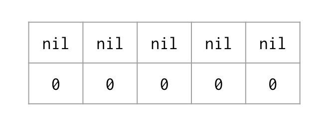
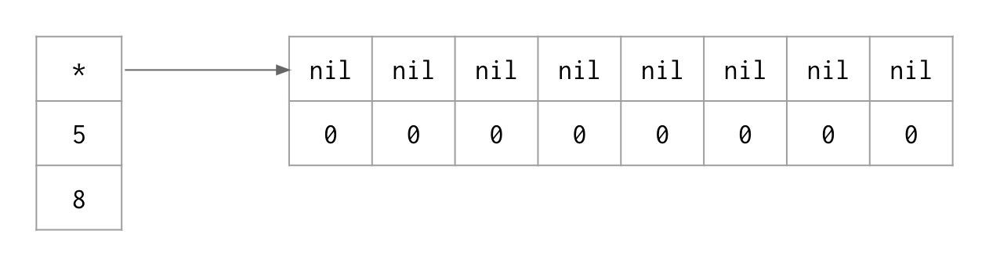

### 데이터 구조(Data Structures)

#### 배열(Array)

##### CPU Cache

Cores DO NOT access main memory directly but their local caches. What store in caches are data and instruction.

Cache speed from fastest to slowest: L1 -> L2 -> L3 -> main memory. As Scott Meyers has said "If performance matters then the total memory you have is the total amount of caches". Access to main memory is incredibly slow. Practically speaking it might not even be there.

So how do we write code that can be sympathetic with the caching system to make sure that we don't have a cache miss or at least, we minimize cache misses to our fullest potential?

Processor has a Prefetcher. It predicts what data is needed ahead of time. There are different granularities depending on where we are on the machine. Our programming model uses a byte. We can read and write to a byte at a time. However, from the caching system point of view, our granularity is not 1 byte. It is 64 bytes, called a cache line. All memory us junked up in this 64 bytes cache line. Since the caching mechanism is complex, Prefetcher tries to hide all the latency from us. It has to be able to pick up on predictable access patterns to data. That said, we need to write code that creates predictable access patterns to data.

One easy way is to create a contiguous allocation of memory and to iterate over them. The array data structure gives us the ability to do so. From the hardware perspective, array is the most important data structure. From Go perspective, slice is. Array is the backing data structure for slice (like Vector in C++). Once we allocate an array, whatever its size, every element is equally distant from other elements. As we iterate over that array, we begin to walk cache line by cache line. As the Prefetcher sees that access pattern, it can pick it up and hide all the latency from us.

For example, we have a big nxn matrix. We do LinkedList Traverse, Column Traverse, and Row Traverse and benchmark against them. Unsurprisingly, Row Traverse has the best performance. It walks through the matrix cache line by cache line and creates a predictable access pattern. Column Traverse does not walk through the matrix cache line by cache line. It looks like a random access memory pattern. That is why it is the slowest among those. However, that doesn't explain why LinkedList Traverse's performance is in the middle. We just think that it might perform as poorly as the Column Traverse. This leads us to another cache: TLB - Translation Lookaside Buffer. Its job is to maintain the operating system’s page and offset to where physical memory is.

Translation Lookaside Buffer
Back to the different granularity, the caching system moves data in and out the hardware at 64 bytes at a time. However, the operating system manages memory by paging its 4K (traditional page size for an operating system).

For every page that we are managing, let's take our virtual memory addresses because that we use (softwares runs virtual addresses, its sandbox, that is how we use/share physical memory) and map it to the right page and offset for that physical memory.

A miss on the TLB can be worse than just the cache miss alone. The LinkedList is somewhere in between because the chance of multiple nodes being on the same page is probably pretty good. Even though we can get cache misses because cache lines aren't necessary in the distance that is predictable, we probably do not have so many TLB cache misses. In the Column Traverse, not only do we have cache misses, we probably have a TLB cache miss on every access as well.

That said, data-oriented design matters. It is not enough to write the most efficient algorithm, how we access our data can have much more lasting effect on the performance than the algorithm itself.

##### Translation Lookaside Buffer

Back to the different granularity, the caching system moves data in and out the
hardware at 64 bytes at a time. However, the operating system manages memory by
paging its 4K (traditional page size for an operating system).

For every page that we are managing, let's take our virtual memory addresses
because that we use (softwares runs virtual addresses, its sandbox, that is how we
use/share physical memory) and map it to the right page and offset for that
physical memory.

A miss on the TLB can be worse than just the cache miss alone. The LinkedList is
somewhere in between because the chance of multiple nodes being on the same page
is probably pretty good. Even though we can get cache misses because cache lines
aren't necessary in the distance that is predictable, we probably do not have so
many TLB cache misses. In the Column Traverse, not only do we have cache misses,
we probably have a TLB cache miss on every access as well.

That said, data-oriented design matters. It is not enough to write the most
efficient algorithm, how we access our data can have much more lasting effect on
the performance than the algorithm itself.

##### 선언과 초기화(Declare and initialize)

문자열이 원소이고 길이가 5인 배열을 선언하고, 제로 값(zero value)으로 초기화 해보자. 다시 한 번 더 말하지만, 문자열은 포인터와 길이를 표현하는 두 워드(word)로 이루어진 데이터 구조다. 이 배열을 제로 값(zero value)으로 설정하면, 배열속의 모든 문자열도 제로 값(zero value)이 된다. 각각의 문자열의 첫 번째 워드는 nil을 가리키고 두 번째 워드는 0이 된다.



```go
var strings [5]string
```

인덱스 0의 문자열은 이제 바이트들(문자열을 구성하는 문자들)을 실제로 저장하고 있는 배열에 대한 포인터와 길이 정보 5를 가지게 된다.

##### 비용이 얼마나 드는가?(What is the cost?)

할당에는 2 바이트를 복사하는 비용이 발생한다. 두 문자열은 같은 배열을 가리키며, 그래서 할당의 비용은 2 단어에 대한 비용뿐이다.

```go
strings[0] = "Apple"
```


슬라이스의 남은 부분에도 값을 할당한다.

```go
strings[1] = "Orange"
strings[2] = "Banana"
strings[3] = "Grape"
strings[4] = "Plum"
```

##### 문자열 배열 반복(Iterate over the array of strings)

range를 사용하면, 인덱스와 복사된 원소의 값을 얻을 수 있다. for 문 내에서 fruit 변수는 문자열 값을 가지게 된다. 첫 번째 반복에서는 "Apple"을 가진다. 이 문자열 역시 위 이미지의 (1) 배열을 가리키는 워드와 길이 5를 나타내는 두 번째 워드를 가진다. 이제 세 개의 문자열의 같은 배열을 공유하고 있다.

**Println 함수에는 무엇을 전달하는가**

여기서는 value의 의미로서 사용한다. 문자열 값을 공유하지 않는다.
Println은 문자열의 값을 복사해서 가진다. Println을 호출 할 때 같은 배열을 공유하는 4개의 문자열을 가지게 되는 것이다. 문자열의 주소를 함수에 전달하지 않으면 이점이 있다. 문자열의 길이를 알고 있으니 스택에 둘 수 있고, 그 덕분에 힙에 할당하여 GC를 해야하는 부담을 덜게 된다.
문자열은 값을 전달하여 스택에 둘 수 있게 디자인 되어, 가비지가 생성되지 않는다. 그래서 문자열(들)이 가리키는 배열만이 힙에 저장되고 공유된다.

```go
fmt.Printf("\n=> Iterate over array\n")
for i, fruit := range strings {
    fmt.Println(i, fruit)
}
```

```
=> Iterate over array
0 Apple
1 Orange
2 Banana
3 Grape
4 Plum
```

4개의 정수를 가지는 배열을 선언하고 리터럴 표기법(literal syntax)으로 특정 값으로 초기화 한다.

```go
numbers := [4]int{10, 20, 30, 40}
```

전통적인 방법으로 배열을 반복한다.

```go
fmt.Printf("\n=> Iterate over array using traditional style\n"​)

for i := 0;i < len(numbers);i++ {
    fmt.Println(i, numbers[i])
}
```

```
=> Iterate over array using traditional style
0 10
1 20
2 30
3 40
```

##### Different type arrays

Declare an array of 5 integers that is initialized to its zero value.

```go
var five [5]int
```

Declare an array of 4 integers that is initialized with some values.

```go
four := [4]int{10, 20, 30, 40}
```

```go
fmt.Printf("\n=> Different type arrays\n")
fmt.Println(five)
fmt.Println(four)
```

```
=> Different type arrays
[0 0 0 0 0]
[10 20 30 40]
```

When we try to assign four to five like so five = four, the compiler says that
"cannot use four (type [4]int) as type [5]int in assignment". This cannot happen
because they have different types (size and representation). The size of an array
makes up its type name: [4]int vs [5]int. Just like what we've seen with pointers.
The * in *int is not an operator but part of the type name. Unsurprisingly, all
arrays have known size at compile time.

##### Contiguous memory allocations

Declare an array of 6 strings initialized with values.

```go
six := [6]string{"Annie", "Betty", "Charley", "Doug", "Edward", "Hoanh"}
```

Iterate over the array displaying the value and address of each element. By
looking at the output of this Printf function, we can see that this array is truly
a contiguous block of memory. We know a string is 2 words and depending on
computer architecture, it will have x byte. The distance between two consecutive
IndexAddr is exactly x byte. v is its own variable on the stack and it has the
same address every single time.

```go
for i, v := range six {
    fmt.Printf("Value[%s]\tAddress[%p] IndexAddr[%p]\n", v, &v, &six[i])
}
```

```
=> Contiguous memory allocations
Value[Annie] Address[0xc000010250] IndexAddr[0xc000052180]
Value[Betty] Address[0xc000010250] IndexAddr[0xc000052190]
Value[Charley] Address[0xc000010250] IndexAddr[0xc0000521a0]
Value[Doug] Address[0xc000010250] IndexAddr[0xc0000521b0]
Value[Edward] Address[0xc000010250] IndexAddr[0xc0000521c0]
Value[Hoanh] Address[0xc000010250] IndexAddr[0xc0000521d0]
```

#### 슬라이스 (Slice)

##### 선언과 초기화 (Declare and initialize)

5개의 요소를 갖는 `슬라이스(slice)`를 생성해보자. `make` 함수는 `슬라이스(slice)`와 `맵(map)` 그리고 `채널(channel)` 타입에서 사용하는, 특별한 내장 함수이다. make 함수를 사용하여 5개의 문자열 배열을 갖는 슬라이스를 생성하면, 3개의 워드(word) 데이터 구조가 만들어진다. 첫 번째 워드는 배열을 위치를 가리키고 두 번째 워드는 길이를, 세 번째 워드는 용량을 나타낸다.


##### 길이와 용량 (Length vs Capacity)

`길이(Length)`는, 포인터의 위치에서부터 접근해서 읽고 쓸 수 있는 요소의 수를 의미하며, `용량(Capacity)`은 포인터의 위치에서부터 배열에 존재할 수 있는 요소의 총량을 뜻한다.

문법적 설탕(syntactic sugar)을 사용하기에, 슬라이스는 언뜻 배열처럼 보인다. 비용도 배열과 동일하게 발생한다. 하지만, 한 가지 다른 점은 make 함수의 `[]string`의 대괄호 안에 값이 없다는 것이다. 이것으로 배열과 슬라이스를 구분할 수 있다. 

```go
slice1 := make([]string, 5)
slice1[0] = "Apple"
slice1[1] = "Orange"
slice1[2] = "Banana"
slice1[3] = "Grape"
slice1[4] = "Plum"
```

슬라이스의 길이를 넘는 인덱스에는 접근할 수 없다.

```
Error: panic: runtime error: index out of range slice1[5] = "Runtime error"
```

슬라이스의 주소가 아닌 값을 전달한다. 따라서, `Println`함수는 슬라이스의 복사본을 갖게 된다.

```go
fmt.Printf("\n=> Printing a slice\n")
fmt.Println(slice1)
```

```
=> Printing a slice
[Apple Orange Banana Grape Plum]
```

##### Reference type

To create a slice with a length of 5 elements and a capacity of 8, we can use the
keyword ​*make*​. _make_ allows us to adjust the capacity directly on construction of
this initialization.

What we end up having now is a 3 word data structure where the first word points
to an array of 8 elements, length is 5 and capacity is 8. It means that I can read
and write to the first 5 elements and I have 3 elements of capacity that I can
leverage later.



```go
slice2 := make([]string, 5, 8)
slice2[0] = "Apple"
slice2[1] = "Orange"
slice2[2] = "Banana"
slice2[3] = "Grape"
slice2[4] = "Plum"
```

```go
fmt.Printf("\n=> Length vs Capacity\n")
inspectSlice(slice2)
```

```go
// inspectSlice exposes the slice header for review.
// Parameter: again, there is no value in side the []string so we want a slice.
// Range over a slice, just like we did with array.
// While len tells us the length, cap tells us the capacity
// In the output, we can see the addresses are aligning as expected.
func inspectSlice(slice []string) {
    fmt.Printf("Length[%d] Capacity[%d]\n", len(slice), cap(slice))
    for i := range slice {
        fmt.Printf("[%d] %p %s\n", i, &slice[i], slice[i])
    }
}
```

```
=> Length vs Capacity
Length[5] Capacity[8]
[0] 0xc00007e000 Apple
[1] 0xc00007e010 Orange
[2] 0xc00007e020 Banana
[3] 0xc00007e030 Grape
[4] 0xc00007e040 Plum
```

##### Idea of appending: making slice a dynamic data structure

Declare a nil slice of strings, set to its zero value. 3 word data structure:

first one points to nil, second and last are zero.

```go
var data []string
```

What if I do data := string{}? Is it the same?

No, because data in this case is not set to its zero value. This is why we always
use var for zero value because not every type when we create an empty literal we
have its zero value in return. What actually happens here is that we have a slice
but it has a pointer (as opposed to nil). This is considered an empty slice, not a
nil slice. There is a semantic between a nil slice and an empty slice. Any
reference type that is set to its zero value can be considered nil. If we pass a
nil slice to a marshal function, we get back a string that says null but when we
pass an empty slice, we get an empty JSON document. But where does that pointer
point to? It is an empty struct, which we will review later.

Capture the capacity of the slice.

```go
    lastCap := cap(data)
```

Append ~100k strings to the slice.

```go
    for record := 1;record <= 102400;record++ {
```

Use the built-in function append to add to the slice. It allows us to add value to
a slice, making the data structure dynamic, yet still allows us to use that
contiguous block of memory that gives us the predictable access pattern from
mechanical sympathy. The append call is working with value semantic. We are not
sharing this slice but appending to it and returning a new copy of it. The slice
gets to stay on the stack, not heap.

```go
    data = append(data, fmt.Sprintf("Rec: %d", record))
```

Every time append runs, it checks the length and capacity. If it is the same, it
means that we have no room. append creates a new backing array, double its size,
copy the old value back in and append the new value. It mutates its copy on its
stack frame and returns us a copy. We replace our slice with the new copy. If it
is not the same, it means that we have extra elements of capacity we can use. Now
we can bring these extra capacities into the length and no copy is being made.
This is very efficient. Looking at the last column in the output, when the backing
array is 1000 elements or less, it doubles the size of the backing array for
growth. Once we pass 1000 elements, the growth rate moves to 25%. When the
capacity of the slice changes, display the changes.

```go
    if lastCap != cap(data) {
```

Calculate the percent of change.

```go
    capChg := float64(cap(data)-lastCap) / float64(lastCap) * 100 
```

Save the new values for capacity.

```go
    lastCap = cap(data)
```

Display the results.

```go
    fmt.Printf("Addr[%p]\tIndex[%d]\t\tCap[%d - %2.f%%]\n", &data[0], record, cap(data), capChg)
```

```
=> Idea of appending
Addr[0xc0000102a0] Index[1] Cap[1 - +Inf%]
Addr[0xc00000c0c0] Index[2] Cap[2 - 100%]
Addr[0xc000016080] Index[3] Cap[4 - 100%]
Addr[0xc00007e080] Index[5] Cap[8 - 100%]
Addr[0xc000100000] Index[9] Cap[16 - 100%]
Addr[0xc000102000] Index[17] Cap[32 - 100%]
Addr[0xc00007a400] Index[33] Cap[64 - 100%]
Addr[0xc000104000] Index[65] Cap[128 - 100%]
Addr[0xc000073000] Index[129] Cap[256 - 100%]
Addr[0xc000106000] Index[257] Cap[512 - 100%]
Addr[0xc00010a000] Index[513] Cap[1024 - 100%]
Addr[0xc000110000] Index[1025] Cap[1280 - 25%]
Addr[0xc00011a000] Index[1281] Cap[1704 - 33%]
Addr[0xc000132000] Index[1705] Cap[2560 - 50%]
Addr[0xc000140000] Index[2561] Cap[3584 - 40%]
Addr[0xc000154000] Index[3585] Cap[4608 - 29%]
Addr[0xc000180000] Index[4609] Cap[6144 - 33%]
Addr[0xc000198000] Index[6145] Cap[7680 - 25%]
Addr[0xc0001b6000] Index[7681] Cap[9728 - 27%]
Addr[0xc000200000] Index[9729] Cap[12288 - 26%]
Addr[0xc000230000] Index[12289] Cap[15360 - 25%]
Addr[0xc000280000] Index[15361] Cap[19456 - 27%]
Addr[0xc000300000] Index[19457] Cap[24576 - 26%]
Addr[0xc000360000] Index[24577] Cap[30720 - 25%]
Addr[0xc000400000] Index[30721] Cap[38400 - 25%]
Addr[0xc000300000] Index[38401] Cap[48128 - 25%]
Addr[0xc000600000] Index[48129] Cap[60416 - 26%]
Addr[0xc0006ec000] Index[60417] Cap[75776 - 25%]
Addr[0xc000814000] Index[75777] Cap[94720 - 25%]
Addr[0xc000600000] Index[94721] Cap[118784 - 25%]
```

##### Slice of slice

Take a slice of slice2. We want just indexes 2 and 3. The length is slice3 is 2
and capacity is 6.

Parameters are [starting_index:(starting_index + length)]

By looking at the output, we can see that they are sharing the same backing array.
These slice headers get to stay on the stack when we use these value semantics.
Only the backing array that needed to be on the heap.

```go
slice3 := slice2[2:4]
```

```go
fmt.Printf("\n=> Slice of slice (before)\n")
inspectSlice(slice2)
inspectSlice(slice3)
```

When we change the value of the index 0 of slice3, who are going to see this
change?

```
=> Slice of slice (before)
Length[5] Capacity[8]
[0] 0xc00007e000 Apple
[1] 0xc00007e010 Orange
[2] 0xc00007e020 Banana
[3] 0xc00007e030 Grape
[4] 0xc00007e040 Plum
Length[2] Capacity[6]
[0] 0xc00007e020 Banana
[1] 0xc00007e030 Grape
```

```go
slice3[0] = "CHANGED"
```

The answer is both. We have to always be aware that we are modifying an existing
slice. We have to be aware who is using it, who is sharing that backing array.

```go
fmt.Printf("\n=> Slice of slice (after)\n")
inspectSlice(slice2)
inspectSlice(slice3)
```

```
=> Slice of slice (after)
Length[5] Capacity[8]
[0] 0xc00007e000 Apple
[1] 0xc00007e010 Orange
[2] 0xc00007e020 CHANGED
[3] 0xc00007e030 Grape
[4] 0xc00007e040 Plum
Length[2] Capacity[6]
[0] 0xc00007e020 CHANGED
[1] 0xc00007e030 Grape
```

How about slice3 := append(slice3, "CHANGED")? Similar problem will occur with
append if the length and capacity is not the same. Instead of changing slice3 at
index 0, we call append on slice3. Since the length of slice3 is 2, capacity is 6
at the moment, we have extra rooms for modification. We go and change the element
at index 3 of slice3, which is index 4 of slice2. That is very dangerous. So, what
if the length and capacity is the same? Instead of making slice3 capacity 6, we
set it to 2 by adding another parameter to the slicing syntax like this: slice3
:= slice2[2:4:4]

When append looks at this slice and sees that the length and capacity is the same,
it wouldn't bring in the element at index 4 of slice2. It would detach. slice3
will have a length of 2 and capacity of 2, still share the same backing array. On
the call to append, length and capacity will be different. The addresses are also
different. This is called a 3 index slice. This new slice will get its own backing
array and we don't affect anything at all to our original slice.

##### Copy a slice

copy only works with string and slice only. Make a new slice big enough to hold
elements of the original slice and copy the values over using the built-in copy
function.

```go
slice4 := make([]string, len(slice2))
copy(slice4, slice2)

fmt.Printf("\n=> Copy a slice\n")
inspectSlice(slice4)
```

```
=> Copy a slice
Length[5] Capacity[5]
[0] 0xc00005c050 Apple
[1] 0xc00005c060 Orange
[2] 0xc00005c070 CHANGED
[3] 0xc00005c080 Grape
[4] 0xc00005c090 Plum
```

##### Slice and reference

Declare a slice of integers with 7 values.

```go
x := make([]int, 7)
```

Random starting counters.

```go
for i := 0; i < 7; i++ {
    x[i] = i * 100
}
```

Set a pointer to the second element of the slice.

```go
twohundred := &x[1]
```

Append a new value to the slice. This line of code raises a red flag. We have x is
a slice with length 7, capacity 7. Since the length and capacity is the same,
append doubles its size then copy values over. x nows points to different memory
block and has a length of 8, capacity of 14.

```go
x = append(x, 800)
```

When we change the value of the second element of the slice, twohundred is not
gonna change because it points to the old slice. Everytime we read it, we will get
the wrong value.

```go
x[1]++
```

By printing out the output, we can see that we are in trouble.

```go
fmt.Printf("\n=> Slice and reference\n")
fmt.Println("twohundred:", *twohundred, "x[1]:", x[1])
```

```
=> Slice and reference
twohundred: 100 x[1]: 101
```

##### UTF-8

Everything in Go is based on UTF-8 character sets. If we use different encoding
scheme, we might have a problem.

Declare a string with both Chinese and English characters. For each Chinese
character, we need 3 byte for each one. The UTF-8 is built on 3 layers: bytes,
code point and character. From Go perspective, string are just bytes. That is what
we are storing.

In our example, the first 3 bytes represents a single code point that represents
that single character. We can have anywhere from 1 to 4 bytes representing a code
point (a code point is a 32 bit value) and anywhere from 1 to multiple code points
can actually represent a character. To keep it simple, we only have 3 bytes
representing 1 code point representing 1 character. So we can read s as 3 bytes, 3
bytes, 1 byte, 1 byte,... (since there are only 2 Chinese characters in the first
place, the rest are English)

```go
s := "世界 means world"
```

UTFMax is 4 -- up to 4 bytes per encoded rune -> maximum number of bytes we need
to represent any code point is 4. mRune is its own type. It is an alias for int32
type. Similar to type byte we are using, it is just an alias for uint8.

```go
var buf [utf8.UTFMax]byte
```

When we are ranging over a string, are we doing it byte by byte or code point by
code point or character by character? The answer is code point by code point.
On the first iteration, i is 0. On the next one, i is 3 because we are moving to
the next code point. Then i is 6.

```go
for i, r := range s {
```

Capture the number of bytes for this rune/code point.

```go
    rl := utf8.RuneLen(r)
```

Calculate the slice offset for the bytes associated with this rune.

```go
    si := i + rl
```

Copy rune from the string to our buffer. We want to go through every code point
and copy them into our array buf, and display them on the screen.
"Every array is just a slice waiting to happen." - Go saying
We are using the slicing syntax, creating our slice header where buf becomes the
backing array. All of them are on the stack. There is no allocation here.

```go
    copy(buf[:], s[i:si])
```

Display the details.

```go
    fmt.Printf("%2d: %q; codepoint: %#6x; encoded bytes: %#v\n"​, i, r, r, buf[:rl])
```

```
0: '世'; codepoint: 0x4e16; encoded bytes: []byte{0xe4, 0xb8, 0x96}
3: '界'; codepoint: 0x754c; encoded bytes: []byte{0xe7, 0x95, 0x8c}
6: ' '; codepoint: 0x20; encoded bytes: []byte{0x20}
7: 'm'; codepoint: 0x6d; encoded bytes: []byte{0x6d}
8: 'e'; codepoint: 0x65; encoded bytes: []byte{0x65}
9: 'a'; codepoint: 0x61; encoded bytes: []byte{0x61}
10: 'n'; codepoint: 0x6e; encoded bytes: []byte{0x6e}
11: 's'; codepoint: 0x73; encoded bytes: []byte{0x73}
12: ' '; codepoint: 0x20; encoded bytes: []byte{0x20}
13: 'w'; codepoint: 0x77; encoded bytes: []byte{0x77}
14: 'o'; codepoint: 0x6f; encoded bytes: []byte{0x6f}
15: 'r'; codepoint: 0x72; encoded bytes: []byte{0x72}
16: 'l'; codepoint: 0x6c; encoded bytes: []byte{0x6c}
17: 'd'; codepoint: 0x64; encoded bytes: []byte{0x64}
```

##### 맵(Map)

프로그램에서 사용할 `user`를 정의한다.

```go
type user struct {
    name string
    username string
}
```

##### 선언과 초기화(Declare and initialize)

`string` 타입을 키로, `user` 타입을 값으로 갖는 맵을 선언하고 만든다.

```go
func main() {
    users1 := make(map[string]user)

    // 맵에 키/값 쌍을 추가한다.
    users1["Roy"] = user{"Rob", "Roy"}
    users1["Ford"] = user{"Henry", "Ford"}
    users1["Mouse"] = user{"Mickey", "Mouse"}
    users1["Jackson"] = user{"Michael", "Jackson"}

    // `map`을 순회한다.
    fmt.Printf("\n=> Iterate over map\n")
    for key, value := range users1 {
            fmt.Println(key, value)
}
```

```
=> Iterate over map
Roy {Rob Roy}
Ford {Henry Ford}
Mouse {Mickey Mouse}
Jackson {Michael Jackson}
```

##### 맵 리터럴(Map literals)

초기값을 갖는 맵을 선언하고 초기화한다.

```go
users2 := map[string]user{
    "Roy": {"Rob", "Roy"},
    "Ford": {"Henry", "Ford"},
    "Mouse": {"Mickey", "Mouse"},
    "Jackson": {"Michael", "Jackson"},
}
```

```go
// 맵을 순회한다.
fmt.Printf("\n=> Map literals\n")
for key, value := range users2 {
    fmt.Println(key, value)
}
```

```
=> Map literals
Roy {Rob Roy}
Ford {Henry Ford}
Mouse {Mickey Mouse}
Jackson {Michael Jackson}
```

##### 키 삭제(Delete key)

```go
delete(users2, "Roy")
```

##### 키 찾기(Find key)

키 `Roy`를 찾아보자. 만약 키 중에 `Roy`가 존재한다면, 그에 해당하는 값을 가져와 할당한다. 그렇지 않다면 `u`는 여전히 `user` 타입의 값을 가지겠지만, 그 값은 제로 값으로 설정된다.

```go
u1, found1 := users2["Roy"]
u2, found2 := users2["Ford"]
```

값과 키의 존재 여부를 나타낸다.

```go
fmt.Printf("\n=> Find key\n")
fmt.Println("Roy", found1, u1)
fmt.Println("Ford", found2, u2)
```

```
=> Find key
Roy false { }
Ford true {Henry Ford}
```

##### 맵의 키 제한(Map key restrictions)

```go
type users []user
```

이 구문을 사용하여 `users` 를 새로 정의할 수 있으며, 이는 `users`를 정의하는 두 번째 방법이다. 이처럼 우리는 기 존재하는 타입을 통해, 또 다른 타입의 기본형으로 사용할 수 있다. 이 때 두 타입은 서로 연관성이 없다. 하지만 다음의 코드 `u := make(map[users]int)`와 같이 키로서 사용코자 할 때, 컴파일러는 다음의 오류를 발생시킨다. "맵의 키로써 `users` 타입은 유효하지 않다."

그 이유는, 키로 어떤 것을 사용하던지 그 값은 반드시 비교가능해야 하기 때문이다. 맵이 키의 해시 값을 만들 수 있는 지 보여주는 일종의 불리언 표현식을 사용해야한다.
