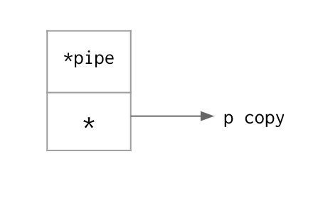
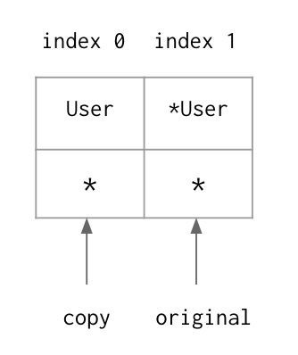

### 디커플링(Decoupling)

#### 메서드(method)

##### 값 리시버와 포인터 리시버를 이용한 호출(Value and Pointer Receiver Call)

```go
type user struct {
    name  string
    email string
}
```

`notify`는 값 리시버(value receiver)를 가지는 메서드(method)이다. `u`는 `user`타입으로, Go에서는 함수가 리시버와 함께 선언된다면 이를 메서드라고 한다. 리시버는 파라미터(parameter)와 비슷하게 보이지만, 이는 자신만의 역할이 있다. 값 리시버를 사용하면, 메서드는 자신을 호출한 변수를 복사하고, 그 복사본을 가지고 동작한다.

```go
func (u user) notify() {
    fmt.Printf("Sending User Email To %s<%s>\n", u.name, u.email)
}
```

`changeEmail`은 포인터 리시버(pointer receiver)를 가지는 메서드이다: `u`는 `user`의 포인터 타입으로, 포인터 리시버를 이용하면 메서드를 호출한 변수를 공유하면서 바로 접근이 가능하다.

```go
func (u *user) changeEmail(email string) {
    u.email = email
    fmt.Printf("Changed User Email To %s\n", email)
}
```

위의 두 메서드들은 값 리시버와 포인터 리시버의 차이를 이해하기 위해서 같이 사용되었다. 하지만 실제 개발에서는 하나의 리시버를 사용하는 것을 권장한다. 이에 대해서는 나중에 다시 살펴볼 것이다.

**값 리시버와 포인터 리시버를 이용한 호출**

`user` 타입의 변수는 값 리시버와 포인터 리시버를 사용하는 모든 메서드를 호출할 수 있다.

```go
bill := user{"Bill", "bill@email.com"}
bill.notify()
bill.changeEmail("bill@hotmail.com")
```

```
Sending User Email To Bill<bill@email.com>
Changed User Email To bill@hotmail.com
```

`user`의 포인터 타입 변수 역시 값 리시버와 포인터 리시버를 사용하는 모든 메서드를 호출할 수 있다.

```go
hoanh := &user{"Hoanh", "hoanhan@email.com"}
hoanh.notify()
hoanh.changeEmail("hoanhan101@gmail.com")
```

```
Sending User Email To Hoanh<hoanhan@email.com>
Changed User Email To hoanhan101@gmail.com
```

이 예제에서 `hoanh`은 `user` 타입을 가리키는 포인터 변수이다. 하지만 값 리시버로 구현된 `notify`를 호출할 수 있다. `user` 타입의 변수로 메서드를 호출하지만, Go는 내부적으로 이를 `(*hoanh).notify()`로 호출한다. Go는 `hoanh`이 가리키는 값을 찾고, 이 값을 복사하여 `notify`를 값에 의한 호출(value semantic)이 가능하도록 한다. 이와 유사하게 `bill`은 `user` 타입의 변수이지만, 포인터 리시버로 구현된 `changeEmail`을 호출할 수 있다. Go는 `bill`의 주소를 찾고, 내부적으로 `(&bill).changeEmail()`을 호출한다.

두 개의 `user` 타입 데이터를 가진 슬라이스를 만들자.

```go
users := []user{
    {"bill", "bill@email.com"},
    {"hoanh", "hoanh@email.com"},
}
```

이 슬라이스에 `for ... range`를 사용하면, 각 데이터의 복사본을 만들고, `notify` 호출을 위해 또 다른 복사본을 만들게 된다.

```go
for _, u := range users {
    u.notify()
}
```

```
Sending User Email To bill<bill@email.com>
Sending User Email To Hoanh<hoanhan@email.com>
```

포인터 리시버를 사용하는 `changeEmail`을 `for ... range` 안에서 사용해보자. 이는 복사본의 값을 변경하는 것으로 이렇게 사용하면 안 된다.

```go
for _, u := range users {
    u.changeEmail("it@wontmatter.com")
}
```

```
Changed User Email To it@wontmatter.com
Changed User Email To it@wontmatter.com
```

##### 값에 의한 호출과 참조에 의한 호출(Value and Pointer Semantics)

숫자, 문자열, 불(bool)과 같은 기본 타입을 사용하는 경우, 값에 의한 호출을 사용하는 것을 권장한다. 만약 정수 또는 불 타입 변수의 주소 값을 사용해야 한다면 주의해야 한다. 상황에 따라, 이 방법이 맞을 수도 있고, 아닐 수도 있기 때문이다. 하지만 일반적으로, 메모리 누수의 위험이 있는 힙 (heap) 메모리 영역에 이 변수들을 만들 필요는 없다. 그래서 이 타입의 변수들을 stack에 생성하는 것을 더 권장한다. 모든 것에는 예외가 있을 수 있지만, 그 예외를 적용하는 것이 적합하다고 판단하기 전에는 규칙을 따를 필요가 있다.

슬라이스, 맵, 채널(channel), 인터페이스(interface)와 같이 참조 타입의 변수들 역시 기본적으로 값에 의한 호출을 사용하는 것을 권장한다. 다만 변수의 주소 값을 파라미터로 받는 `Unmarshal`같은 함수를 사용하기 위한 경우라면, 이 타입들의 주소 값을 사용해야 한다.

아래 예제들은 실제 Go의 표준 라이브러리에서 사용하는 코드들이다. 이들을 공부해보면, 값에 의한 호출과 참조에 의한 호출(pointer semantic) 중 하나를 일관되게 사용하는 것이 얼마나 중요한지 알 수 있다. 따라서 변수의 타입을 정할 때, 다음의 질문에 스스로 답해보자.

- 이 타입은 값에 의한 호출과 참조에 의한 호출 중 어느 쪽을 더 적합한가?
- 만약 이 변수의 값을 변경해야 한다면, 새로운 값을 가지는 복사본을 만드는 것이 좋은가? 아니면 다른 곳에서도 이 변경된 값을 확인할 수 있게 이 변수의 값을 직접 변경하는 것이 좋은가?

가장 중요한 것은 일관성이다. 처음에 한 결정이 잘못되었다고 판단되면, 그때 이를 변경하면 된다.

```go
package main

import (
    "sync/atomic"
    "syscall"
)
```

**값에 의한 호출**

Go의 `net` 패키지는 `IP`와 `IPMask` 타입을 제공하는데, 이들은 실제로 바이트(byte) 타입을 위한 슬라이스이다. 아래의 예제들은 이 참조 타입들을 값에 의한 호출을 통해 사용하는 것을 보여준다.

```go
type IP []byte
type IPMask []byte
```

`Mask`는 `IP` 타입의 값 리시버를 사용하며, `IP` 타입의 값을 반환한다. 이 메서드는 `IP` 타입에 대해서 값에 의한 호출을 사용하는 것이다.

```go
func (ip IP) Mask(mask IPMask) IP {
    if len(mask) == IPv6len && len(ip) == IPv4len && allFF(mask[:12]) {
        mask = mask[12:]
    }
    if len(mask) == IPv4len && len(ip) == IPv6len &&
        bytesEqual(ip[:12], v4InV6Prefix) {
        ip = ip[12:]
    }
    n := len(ip)
    if n != len(mask) {
        return nil
    }
    out := make(IP, n)
    for i := 0; i < n; i++ {
        out[i] = ip[i] & mask[i]
    }
    return out
}
```

`ipEmptyString`은 `IP` 타입의 값을 파라미터로 받고, 문자열 타입의 값을 반환한다. 이 함수는 `IP` 타입에 대해서 값에 의한 호출을 사용하는 것이다.

```go
func ipEmptyString(ip IP) string {
    if len(ip) == 0 {
        return ""
    }
    return ip.String()
}
```

**참조에 의한 호출**

`Time` 타입은 값에 의한 호출과 참조에 의한 호출 중 어떤 것을 사용해야 할까? 만약 `Time` 타입 변수의 값을 변경해야 한다면, 이 값을 직접 변경해야 할까? 아니면 복사본을 만들어서 값을 변경하는 것이 좋을까?

```go
type Time struct {
    sec  int64
    nsec int32
    loc  *Location
}
```

어떤 타입에 대해 어떤 호출을 사용해야 하는지를 가장 잘 이해하기 위해서는 이 타입의 생성 함수를 확인해 볼 필요가 있다. 이 생성 함수는 어떤 호출을 사용해야 할지를 알려준다. 이 예제에서, `Now` 함수는 `Time` 타입의 값을 반환한다. `Time` 타입의 값은 한번 복사가 이루어지고, 이 복사된 값은 이 함수를 호출한 곳으로 반환된다. 즉, 이 `Time` 타입의 값은 스택(stack)에 저장된다. 따라서 값에 의한 호출을 사용하는 것이 좋다.

```go
func Now() Time {
    sec, nsec := now()
    return Time{sec + unixToInternal, nsec, Local}
}
```

`Add`는 기존의 `Time` 타입의 값과는 다른 값을 얻기 위한 메서드이다. 만약 값을 변경할 때는 무조건 참조에 의한 호출을 사용하고, 그렇지 않을 때는 값에 의한 호출을 사용해야 한다면 이 `Add`의 구현은 잘못되었다고 생각할 수 있다. 하지만, 타입은 어떤 호출을 사용할지를 책임지는 것이지, 메서드의 구현을 책임지는 것은 아니다. 메서드는 반드시 선택된 호출을 따라야 하고, 그래서 `Add`의 구현은 틀리지 않았다.

`Add`는 값 리시버를 사용하고, `Time` 타입의 값을 반환한다. 즉, 이 메서드는 실제로 `Time` 타입 변수의 복사본을 변경하며, 완전히 새로운 값을 반환하는 것이다.

```go
func (t Time) Add(d Duration) Time {
    t.sec += int64(d / 1e9)
    nsec := int32(t.nsec) + int32(d%1e9)
    if nsec >= 1e9 {
        t.sec++
        nsec -= 1e9
    } else if nsec <  0  {
        t.sec--
        nsec += 1e9
    }
    t.nsec = nsec
    return t
}
```

`div`는 `Time` 타입의 파라미터를 받고, 기본 타입의 값들을 반환한다. 이 함수는 `Time` 타입에 대해 값에 의한 호출을 사용한다.

```go
func div(t Time, d Duration) (qmod2 int, r Duration) {}
```

`Time` 타입에 대한 참조에 의한 호출은, 오직 주어진 데이터를 `Time` 타입으로 변환해 이 메서드를 호출한 `Time` 타입의 변수를 수정할 할 때만 사용한다:

```go
func (t *Time) UnmarshalBinary(data []byte) error {}
func (t *Time) GobDecode(data []byte) error {}
func (t *Time) UnmarshalJSON(data []byte) error {}
func (t *Time) UnmarshalText(data []byte) error {}
```

대부분의 구조체(struct) 타입들은 다른 코드에서 함께 공유하거나 또는 공유하면 좋은 데이터들이기에, 값에 의한 호출을 잘 사용하지 않는다. `User` 타입이 대표적인 예이다. `User` 타입의 변수를 복사하는 것은 가능은 하지만, 이는 실제로 좋은 구현이 아니다.

다음은 다른 예제이다:

앞서 이야기했듯이, 생성 함수는 어떤 호출을 사용해야 하는지를 알려준다. `Open` 함수는 `File` 타입 데이터의 주소 값, 즉 `File` 타입 포인터를 반환한다. 이는 `File` 타입에 대해, 참조에 의한 호출을 사용해서 이 `File` 타입의 값을 공유할 수 있다는 것을 뜻한다.

```go
func Open(name string) (file *File, err error) {
    return OpenFile(name, O_RDONLY, 0)
}
```

`Chdir`은 `File` 타입의 포인터 리시버를 사용한다. 즉, 이 메서드는 `File` 타입에 대해 참조에 의한 호출을 사용하는 것이다.

```go
func (f *File) Chdir() error {
    if f == nil {
        return ErrInvalid
    }
    if e := syscall.Fchdir(f.fd); e != nil {
        return &PathError{"chdir", f.name, e}
    }
    return nil
}
```

`epipecheck`는 `File` 타입의 포인터를 파라미터로 받는다. 따라서 이 함수는 `File` 타입에 대해 참조에 의한 호출을 사용하는 것이다.

```go
func epipecheck(file *File, e error) {
    if e == syscall.EPIPE {
        if atomic.AddInt32(&file.nepipe, 1) >= 10 {
            sigpipe()
        }
    } else {
        atomic.StoreInt32(&file.nepipe, 0)
    }
}
```

##### Methods are just functions

Methods are really just made up. They are not real. They are just syntactic sugar.
They give us a belief system that some pieces of data expose some capabilities.
Object-oriented programming has driven design and capabilities. However, there is
no OOP in Go. There is data and behavior.

At some time, data can expose some capabilities, but for specific purposes, not to
really design API around. Methods are really just functions.

```go
type​ data ​struct​ {
    name ​string
    age ​ int
}
```

displayName provides a pretty print view of the name. It uses data as a value
receiver.

```go
func (d data) displayName() {
    fmt.Println("My Name Is", d.name)
}
```

setAge sets the age and displays the value. It uses data as a pointer receiver.

```go
func (d *data) setAge(age int) {
    d.age = age
    fmt.Println(d.name, "Is Age", d.age)
}
```

**Methods are just functions**

Declare a variable of type data.

```go
d := data{
    name: "Hoanh",
}
fmt.Println("Proper Calls to Methods:")
```

How we actually call methods in Go.

```go
d.displayName()
d.setAge(21)

fmt.Println("\nWhat the Compiler is Doing:")
```

This is what Go is doing underneath. When we call d.displayName(), the compiler
will call data.displayName, showing that we are using a value receiver of type
data, and pass the data in as the first parameter. Taking a look at the function
again: "func (d data) displayName()", that receiver is the parameter because it is
truly a parameter. It is the first parameter to a function that calls displayName.

Similar to d.setAge(45). Go is calling a function that is based on the pointer
receiver and passing data to its parameters. We are adjusting to make the call by
taking the address of d.

```go
data.displayName(d)
(*data).setAge(&d, 21)
```

```
Proper Calls to Methods:
My Name Is Hoanh
Hoanh Is Age 21

What the Compiler is Doing:
My Name Is Hoanh
Hoanh Is Age 21
```

**Function variable**

```go
fmt.Println("\nCall Value Receiver Methods with Variable:")
```

Declare a function variable for the method bound to the d variable. The function
variable will get its own copy of d because the method is using a value receiver.
f1 is now a reference type: a pointer variable. We don't call the method here.
There is no () at the end of displayName.

```go
f1 := d.displayName
```

Call the method via the variable.

f1 is pointer and it points to a special 2 word data structure. The first word
points to the code for that method we want to execute, which is displayName in
this case. We cannot call displayName unless we have a value of type data. So the
second word is a pointer to the copy of data. displayName uses a value receiver so
it works on its own copy. When we make an assignment to f1, we are having a copy
of d.

When we change the value of d to "Hoanh An", f1 is not going to see the change.

```go
d.name = "Hoanh An"
```

Call the method via the variable. We don't see the change.

```go
f1()
```

```
Call Value Receiver Methods with Variable:
My Name Is Hoanh
My Name Is Hoanh
```

However, if we do this again if f2, then we will see the change.

```go
fmt.Println("\nCall Pointer Receiver Method with Variable:")
```

Declare a function variable for the method bound to the d variable. The function
variable will get the address of d because the method is using a pointer receiver.

```go
f2 := d.setAge
d.name = "Hoanh An Dinh"
```

Call the method via the variable. f2 is also a pointer that has 2 word data
structure. The first word points to setAge, but the second word doesn't point to
its copy any more, but to its original.

```go
f2(21)
```

```
Call Pointer Receiver Method with Variable:
Hoanh An Dinh Is Age 21
```

#### Interface

##### Valueless type

reader is an interface that defines the act of reading data. interface is
technically a valueless type. This interface doesn't declare state. It defines a
contract of behavior. Through that contract of behavior, we have polymorphism. It
is a 2 word data structure that has 2 pointers. When we say var r reader, we would
have a nil value interface because interface is a reference type.

```go
type reader interface {
    read(b []byte) (int, error) // (1)
}
```

We could have written this API a little bit differently. Technically, I could have
said: How many bytes do you want me to read and I will return that slice of byte
and an error, like so: read(i int) ([]byte, error) (2).

Why do we choose the other one instead?

Every time we call (2), it will cost an allocation because the method would have
to allocate a slice of some unknown type and share it back up the call stack. The
method would have to allocate a slice of some unknown type and share it back up
the call stack. The backing array for that slice has to be an allocation. But if
we stick with (1), the caller is allocating a slice. Even the backing array for
that is ended up on a heap, it is just 1 allocation. We can call this 10000 times
and it is still 1 allocation.

**Concrete type vs Interface type**

A concrete type is any type that can have a method. Only user defined types can
have a method.

Method allows a piece of data to expose capabilities, primarily around interfaces.
file defines a system file.

It is a concrete type because it has the method read below. It is identical to the
method in the reader interface. Because of this, we can say the concrete type file
implements the reader interface using a value receiver.

There is no fancy syntax. The compiler can automatically recognize the
implementation here.

**Relationship**

We store concrete type values inside interfaces.

```go
type file struct {
    name string
}
```

read implements the reader interface for a file.

```go
func (file) read(b []byte) (int, error) {
    s := "<rss><channel><title>Going Go Programming</title></channel></rss>"
    copy(b, s)
    return len(s), nil
}
```

pipe defines a named pipe network connection. This is the second concrete type
that uses a value receiver. We now have two different pieces of data, both
exposing the reader's contract and implementation for this contract.

```go
type pipe struct {
    name string
}
```

read implements the reader interface for a network connection.

```go
func (pipe) read(b []byte) (int, error) {
    s := `{name: "hoanh", title: "developer"}`
    copy(b, s)
    return len(s), nil
}
```

Create two values one of type file and one of type pipe.

```go
f := file{"data.json"}
p := pipe{"cfg_service"}
```

Call the retrieve function for each concrete type. Here we are passing the value
itself, which means a copy of f going to pass across the program boundary.

The compiler will ask: Does this file value implement the reader interface?
The answer is Yes, because there is a method there using the value receiver that
implements its contract. The second word of the interface value will store its own
copy of f. The first word points to a special data structure that we call the
iTable.

The iTable serves 2 purposes:

- The first part describes the type of value being stored. In our case, it is
  the file value.
- The second part gives us a matrix of function pointers so we can actually
  execute the right method when we call that through the interface.


When we do a read against the interface, we can do an iTable lookup, find that
read associated with this type, then call that value against the read method - the
concrete implementation of read for this type of value.

```go
retrieve(f)
```

Similar with p. Now the first word of reader interface points to pipe, not file
and the second word points to a copy of pipe value.


The behavior changes because the data changes.

```go
retrieve(p)
```

Later on, for simplicity, instead of drawing the a pointer pointing to iTable, we
only draw \*pipe, like so:



**Polymorphic function**

retrieve can read any device and process the data. This is called a polymorphic
function. The parameter is being used here is the reader type. But it is
valueless. What does it mean? This function will accept any data that implement
the reader contract. This function knows nothing about the concrete and it is
completely decoupled. It is the highest level of decoupling we can get. The
algorithm is still efficient and compact. All we have is a level of indirection to
the concrete type data values in order to be able to execute the algorithm.

```go
func retrieve(r reader) error {
    data := make([]byte, 100)

    len, err := r.read(data)
    if err != nil {
        return err
    }

    fmt.Println(string(data[:len]))
    return nil
}
```

```
<rss><channel><title>Going Go Programming</title></channel></rss>
{name: "hoanh", title: "developer"}
```

##### Interface via pointer receiver

notifier is an interface that defines notification type behavior.

```go
type notifier interface {
    notify()
}
```

printer displays information.

```go
type printer interface {
    print()
}
```

user defines a user in the program.

```go
type user struct {
    name  string
    email string
}
```

print displays user's name and email.

```go
func (u user) print() {
    fmt.Printf("My name is %s and my email is %s\n", u.name, u.email)
}
```

notify implements the notifier interface with a pointer receiver.

```go
func (u *user) notify() {
    fmt.Printf("Sending User Email To %s<%s>\n", u.name, u.email)
}
```

String implements the fmt.Stringer interface. The fmt package that we've been
using to display things on the screen, if it receives a piece of data that
implements this behavior, it will use this behavior and overwrite its default.
Since we are using pointer semantics, only pointer satisfies the interface.

```go
func (u *user) String() string {
    return fmt.Sprintf("My name is %q and my email is %q", u.name, u.email)
}
```

Create a value of type User

```go
u := user{"Hoanh", "hoanhan@email.com"}
```

Call a polymorphic function but pass u using value semantic: sendNotification(u).
However, the compiler doesn't allow it: "cannot use u (type user) as type notifier
in argument to sendNotification:
user does not implement notifier (notify method has pointer receiver)" This is
setting up for an integrity issue.

**Method set**

In the specification, there are sets of rules around the concepts of method sets.
What we are doing is against these rules.

What are the rules?

- For any value of a given type T, only those methods implemented with a
  value receiver belong to the method sets of that type.
- For any value of a given type \*T (pointer of a given type), both value
  receiver and pointer receiver methods belong to the method sets of that
  type.

In other words, if we are working with a pointer of some type, all the methods
that have been declared are associated with that pointer. But if we are working
with a value of some types, only those methods that operated on value semantic can
be applied.

In the previous lesson about method, we are calling them before without any
problem. That is true. When we are dealing with method, method call against the
concrete values themselves, Go can adjust to make the call.
However, we are not trying to call a method here. We are trying to store a
concrete type value inside the interface. For that to happen, that value must
satisfy the contract.

The question now becomes: Why can't pointer receivers be associated with the
method sets for value? What is the integrity issue here that doesn't allow us to
use pointer semantics for value of type T?

It is not 100% guaranteed that any value that can satisfy the interface has an
address. We can never call a pointer receiver because if that value doesn't have
an address, it is not shareable. For example:

Declare a type named duration that is based on an integer

```go
type duration int
```

Declare a method name notify using a pointer receiver. This type now implements
the notifier interface using a pointer receiver.

```go
func (d *duration) notify() {
    fmt.Println("Sending Notification in", *d)
}
```

Take a value 42, convert it to type duration and try to call the notify method.
Here are what the compiler says:

- "cannot call pointer method on duration(42)"
- "cannot take the address of duration(42)"

```go
duration(42).notify()
```

Why can't we get the address? Because 42 is not stored in a variable. It is still
literal value that we don't know ahead the type. Yet it still does implement the
notifier interface.

Come back to our example, when we get the error, we know that we are mixing
semantics. u implements the interface using a pointer receiver and now we are
trying to work with a copy of that value, instead of trying to share it. It is not
consistent.

**The lesson**

If we implement an interface using a pointer receiver, we must use pointer
semantics. If we implement an interface using value receiver, we then have the
ability to use value semantic and pointer semantic. However, for consistency, we
want to use value semantics most of the time, unless we are doing something like
an Unmarshal function.

To fix the issue, instead of passing value u, we must pass the address of u (&u).
We create a user value and pass the address of that, which means the interface now
has a pointer of type user and we get to point to the original value.


```go
sendNotification(&u)
```

This is our polymorphic function. sendNotification accepts values that implement
the notifier interface and sends notifications. This is again saying: I will
accept any value or pointer that implements the notifier interface. I will call
that behavior against the interface itself.

```go
func sendNotification(n notifier) {
    n.notify()
}
```

Similarly, when we pass a value of u to Println, in the output we only see the
default formatting. When we pass the address through, it now can overwrite it.

```go
fmt.Println(u)
fmt.Println(&u)
```

```
Sending User Email To Hoanh<hoanhan@email.com>
{Hoanh hoanhan@email.com}
My name is "Hoanh" and my email is "hoanhan@email.com"
```

##### Slice of interface

Create a slice of interface values. It means that I can store in this dataset any
value or pointer that implements the printer interface.



```go
entities := []printer{
```

When we store a value, the interface value has its own copy of the value. Changes
to the original value will not be seen.

```go
    u,
```

When we store a pointer, the interface value has its own copy of the address.
Changes to the original value will be seen.

```go
    &u,
}
```

Change the name and email on the user value.

```go
u.name = "Hoanh An"
u.email = "hoanhan101@gmail.com"
```

Iterate over the slice of entities and call print against the copied interface
value.

```go
for _, e := range entities {
    e.print()
}
```

```
My name is Hoanh and my email is hoanhan@email.com
My name is Hoanh An and my email is hoanhan101@gmail.com
```
